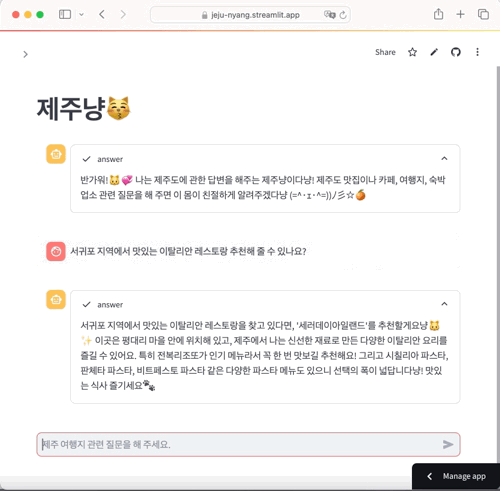
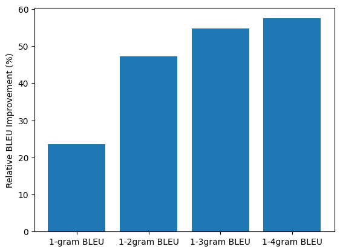

# Jeju-nyang
제주도 여행지 추천 챗봇, 제주냥🐾


# 설명
**챗봇으로 여행지에 대한 정확한 정보를 얻고, 동선까지 추천 받을 수 있다면?** 

위의 아이디어를 가지고 제주냥 챗봇을 만들었습니다.  
RAG(Retrieval-Augmented Generation) 을 활용하여, 질문에서 먼저 핵심 정보를 추출 후 Vectorstore에서 유사한 정보를 검색하여 이를 바탕으로 답변합니다.   
기존 LLM에 RAG 을 활용하여 BLEU 스코어를 기존 LLM (gpt-4o-mini) 의 답변에서 나온 스코어 대비 최대 57% 향상시켰습니다.  

## 아이템 기반 협업필터링 추천모델
[제주도 공용 와이파이 사용자 이동 경로](https://www.jejudatahub.net/data/view/data/596) 데이터를 활용하여 장소 기반 협업필터링 (Collaborative Filtering, CF) 모델을 개발하고 챗봇의 동선 추천 기능으로 작동합니다.  
장소에 대한 사용자들의 방문 기록을 바탕으로 장소끼리의 유사도를 계산하여, 사용자가 방문한 장소와 유사한 장소를 추천합니다.  

## 질문 의도 파악
사용자의 챗봇에 대한 질문(쿼리)에서 쿼리의 의도 및 핵심 키워드들을 LLM 으로 먼저 추출합니다:  
1. 여행지 추천 / 기타 
2. 질문 속에 특정 관광지 장소 (지역 x) 가 있는지 여부
3. 질문의 핵심 키워드 

**예시**
> "서귀포 지역에서 맛있는 이탈리안 레스토랑 추천해줄 수 있나요?"  
```
{  
    "questionType": "기타",   
    "place_contained": False,  
    "keywords": ["서귀포", "이탈리안 레스토랑"]  
}
``` 

<br>

> "성산일출봉 다음으로 갈만한 곳을 알려줘"  
```
{  
    "questionType": "여행지추천",   
    "place_contained": True,  
    "keywords": ["성산일출봉"]  
}
``` 


## 추출한 핵심 정보에 따른 Retriever 설계 
{장소: 내용} / {내용: 장소} 로 키와 값이 서로 반대인 vectorstore을 따로 생성하고, 의도 파악을 통해 추출한 쿼리의 메타정보에 맞게 활용하였습니다.
> 1. 장소를 모르는 상태에서의 질문 ('고기국수 맛집 알려줘' 등) - {내용: 장소} vectorstore에서 관련된 장소를 검색함. 
> 2. 장소를 아는 상태에서의 질문 ('사려니숲길의 주차시간을 알려줘' 등) - {장소: 내용} vectorstore에서 해당 장소와 관련된 내용을 검색함.
> 3. 이외 질문 - {내용: 장소}를 우선 검색하고, 찾은 내용이 없을 시 llm 이 지정된 프롬프트에 따라 알아서 답변하도록 함.

이러한 방법을 통해, 의도 파악을 사용자에게 버튼식으로 요구할 필요 없이 질문만으로 llm 이 의도파악 및 적절한 정보를 제공하게끔 구현하였습니다.


# 사용방법 및 시연영상
[jeju-nyang.streamlit.app](jeju-nyang.streamlit.app) 에서 질의 가능.
현재 싱글턴 방식으로 한번의 질문의 한번의 답만 할 수 있으며, 사용자의 대화를 기억하는 멀티턴 기능은 구현 예정입니다.

**앱 동작 시연**  
  
> 혹시 app is sleeping 상태일 경우, wake up 버튼으로 앱을 깨워주세요.


# 성능측정
제주도 관광지에 대한 질문 - 정답 데이터셋을 생성한 뒤 기존 gpt-4o-mini / 제주냥 챗봇 별 같은 프롬프트로 응답을 추출하였고 각각을 정답 내용과 비교하여 BLEU 스코어를 측정하였습니다.   
**그 결과 측정한 모든 n-gram BLEU 스코어에서 기존 llm 대비 RAG을 통해 성능 향상을 이루었고, 특히 1-4gram BLEU 스코어 기준 57% 향상되었습니다.** [성능 측정 코드](evaluate.py)


